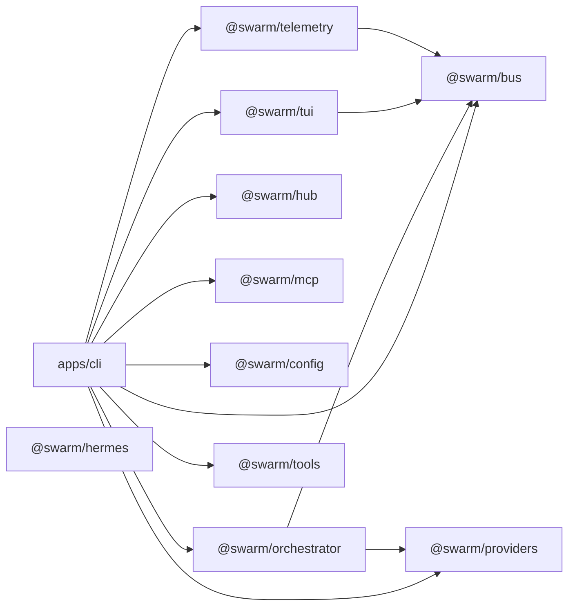
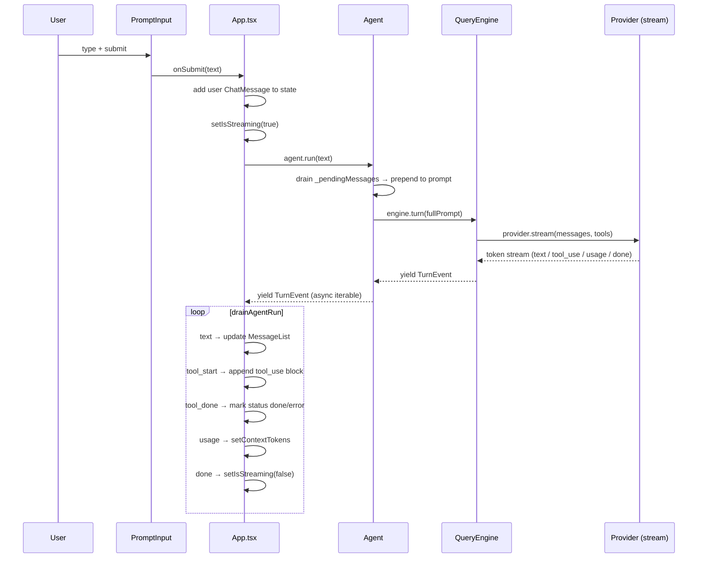
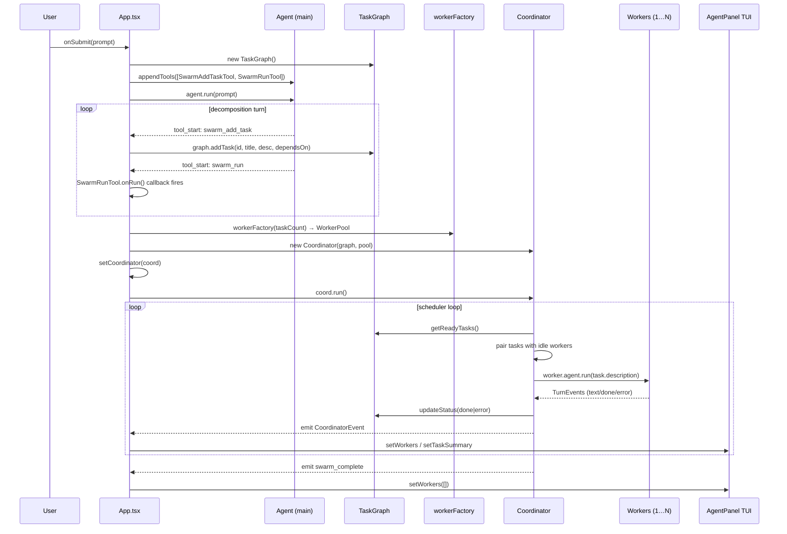
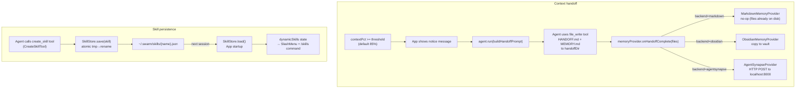
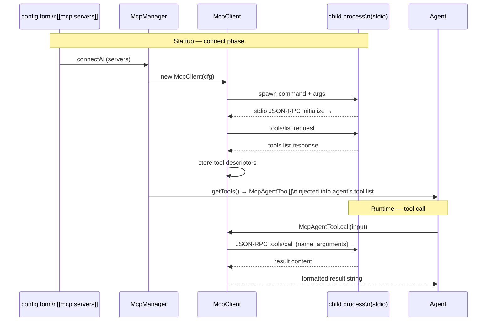
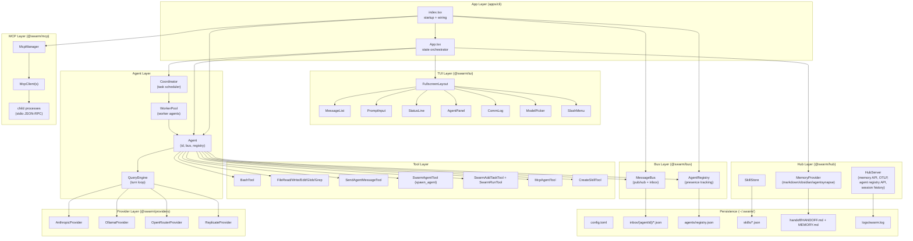

# Pi3 Architecture

Multi-agent AI terminal built on Bun + Ink v6 + React 19. This document describes the system through seven diagrams, from package structure down to individual data flows.

---

## 1. Package Dependency Graph



Leaf packages (`bus`, `hub`, `mcp`, `config`, `tools`, `providers`, `hermes`) have no internal workspace dependencies.

---

## 2. Single-Agent Chat Flow

What happens from the moment the user presses Enter until the response is fully rendered.



---

## 3. Swarm Mode Flow

How a single user prompt becomes a parallel multi-agent execution.



---

## 4. Inter-Agent Messaging (Bus + Inbox)

Two delivery paths exist: in-process for agents within the same session, and cross-process for agents in separate sessions.

```mermaid
flowchart TD
    subgraph IN["In-process (same session)"]
        A1["Agent A\n(send_agent_message tool)"]
        SAM["SendAgentMessageTool"]
        MB["MessageBus\npublish() / banter()"]
        SUB["subscriber handler\n(registered at Agent construction)"]
        PM["Agent B._pendingMessages"]
        NEXT["Agent B.run() — next turn\ninjects queued messages"]

        A1 -->|calls| SAM
        SAM -->|bus.publish(msg) or bus.banter(msg)| MB
        MB -->|_route(msg) → handler| SUB
        SUB -->|push| PM
        PM -->|prepended to prompt| NEXT
    end

    subgraph BANTER["Banter (query + reply)"]
        Q["Agent A\nbanter(queryMsg)"]
        PB["_pendingBanter Map\nkeyed by msg.id"]
        REP["Agent B publishes\ntype=reply, correlationId=msg.id"]
        RES["Promise resolves\nwith reply message"]

        Q -->|registers Promise| PB
        REP -->|publish resolves| PB
        PB --> RES
    end

    subgraph XP["Cross-process (different sessions)"]
        A2["Agent A\n(external process)"]
        MB2["MessageBus.publish()"]
        PERSIST["_persistToInbox()\natomic tmp→rename"]
        INBOX["~/.swarm/inbox/main/\n{ts}-{id}.json"]
        POLL["App.tsx setInterval 2s\nbus.readInbox('main')"]
        INJECT["agent.injectMessage(msg)\ndeduped by seenIds Set"]

        A2 --> MB2
        MB2 --> PERSIST
        PERSIST --> INBOX
        INBOX -->|file read| POLL
        POLL --> INJECT
    end
```

---

## 5. Memory & Handoff Flow

How the agent preserves context across sessions, and how skills persist between runs.



---

## 6. MCP Integration

How external tools from Model Context Protocol servers are discovered and called.



---

## 7. Full System Component Map


